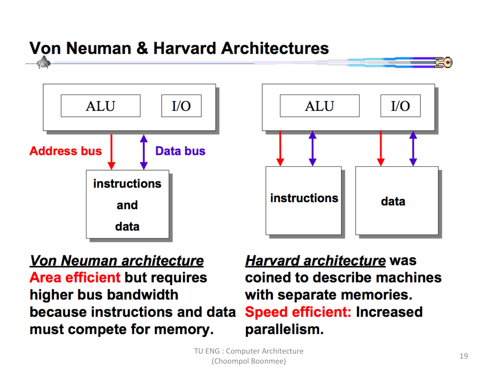
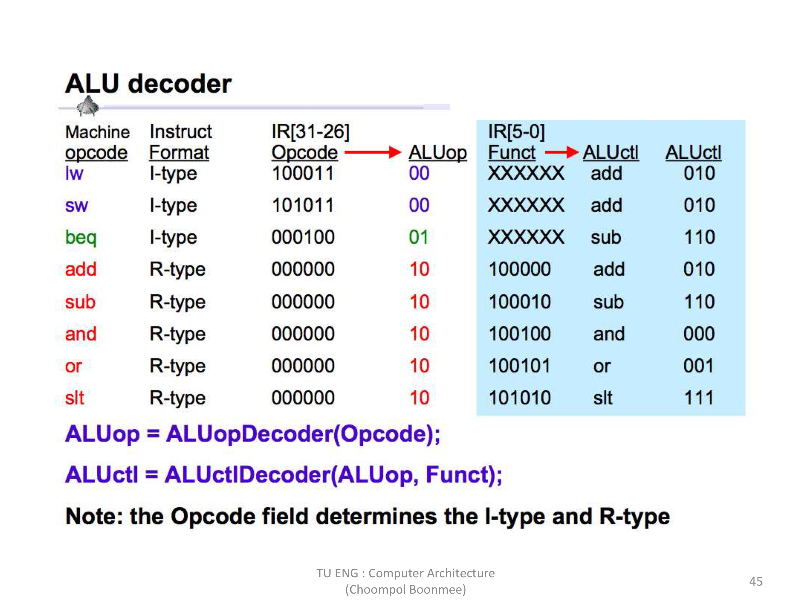
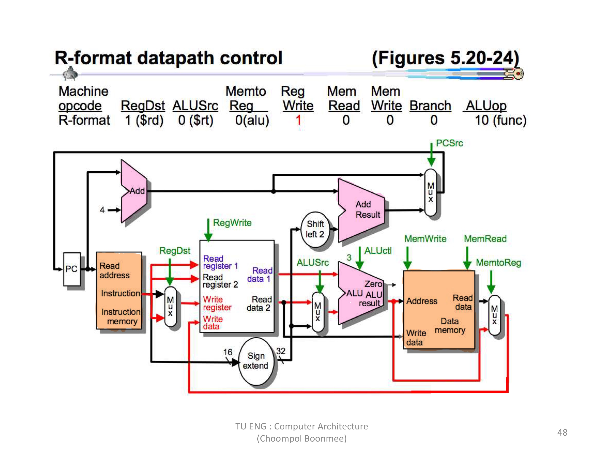
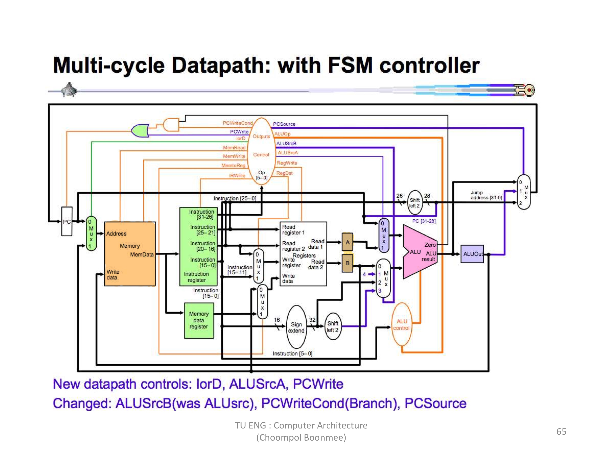
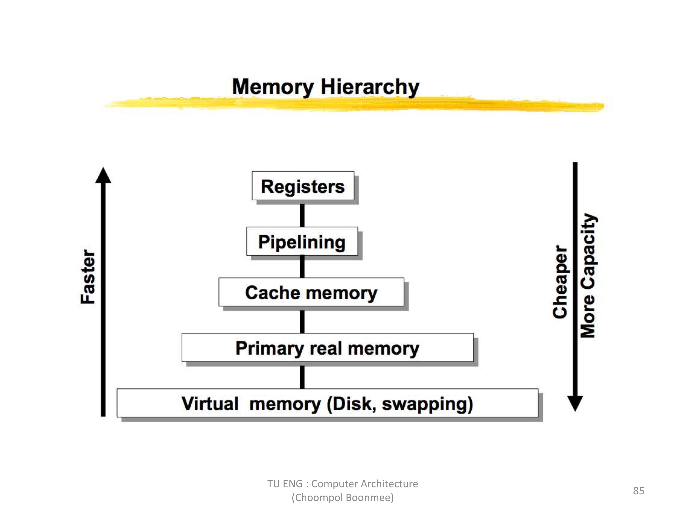
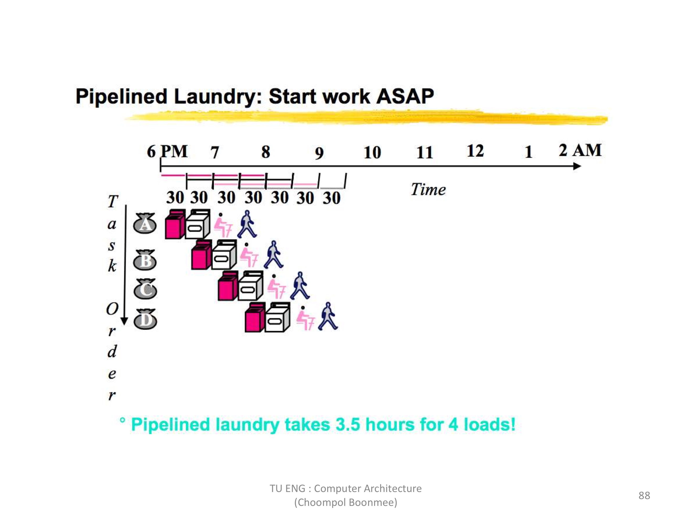
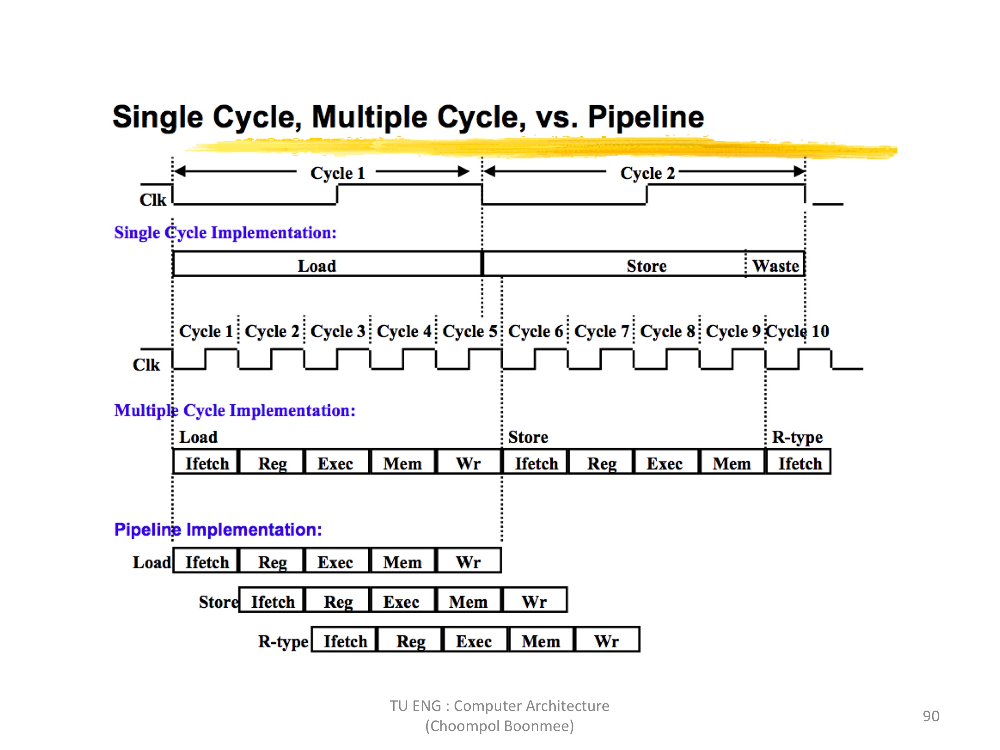

## รายงาน
## วิชา Computer Architecture สถาปัตยกรรมคอมพิวเตอร์
### สรุปเนื้อหา

### MIPS Instruction format

ทุกคำสั่งใน MIPS จะมีขนาด 32 bits

มี 3 ประเภท

 **R-Format** (ส่วนใหญ่ใช้ในการคำนวณทางตรรกศาสตร์)

|R-Format|    |   |    |    |    |
----- | ----- | ----- | ----- | ----- | ----- |
|op  | rs  |  rt | rd  | shamt  | func  |

|คำสั่ง |    |
----- | ----- |
|ALU  |   alu    $rd,$rs,$rt|
|jr   |   jr     $rs|

 **I-Format** (ใช้ย้ายข้อมูลเปลี่ยนข้อมูล)

|I-Format|     |     |      |   
----- | ----- | ----- | ----- | 
|op  | rs  |  rt | value or offset |

|คำสั่ง |    |
----- | ----- |
|ALUi      |  alui  $rt,$rs,value |
|Data  Transfer    |  lw    $rt,offset($rs) |
|                  |  sw    $rt,offset($rs) |
|Branch            |  beq   $rs,$rt,offset |

 **J-Format** (Jumpไปทำงานที่อื่น)

|J-Format|    |   
----- | ----- | 
|op  | absolute address |

|คำสั่ง |    |
----- | ----- |
|Jump      |  j   address|
|Jump&Link  | jal   address|

### Von Neuman & Harvard Architectures

 **Von Neuman**

  * เป็นระบบคอมพิวเตอร์ที่หัวใจสำคัญ ทั้งคำสั่งและข้อมูลจะถูกเก็บบนหน่วยความจำเดียวกัน
    
 **Harvard Architecture**

  * เป็นระบบคอมพิวเตอร์ที่เก็บคำสั่งกละข้อมูลแยกกันทำให้มีความเร็วในการประมวลผลดีกว่า
    
### Complex Instruction Set Computer(CISC) vs Reduced Instruction Set Computer(RISC)
 
 **CISC**

   * ชุดคำสั่งมีหลากหลาย 
   * เป็นแบบ Multi cycle ทุกคำสั่งใช้เวลไม่เท่ากัน
   * เขียนโรแกรม/ด้ง่ายกว่าเพราะมีชุดคำสั่งเยอะ
   * มีคำสั่งที่เข้าไปใน memory นกกจากคำสั่ง load word,store word
   * ขนาดของ instruction สามารถเปลี่ยนแปลงได้
  
 **RISC**

   * ใช้ operation เรียบง่าย
   * เป็นแบบ single cycle แต่ละคำสั่งใช้เวลาเท่ากัน
   * การเข้าถึงหน่วยความจำหลักใช้ load word กับ store word เท่านั้น
   * กำหนดขนาดของ instruction ให้มีขนาดที่แน่นอน
        
## การบ้านครั้งที่ 1

### คำสั่ง ADD ในคอมพิวเตอร์ MIPS

ซึ่งเป็นคำสั่ง ประเภท R-Format 

หลักการทำงาน คือ $rd <- $rs + $rt (ภาษาที่มนุษย์เข้าใจ)

ตัวอย่าง

|register   | registerตัวที่   | binary |
----- | -----  | ----- |
| rs |    $3   |  00011  |
| rt |    $2   |  00010  |
| rd |    $8   |  01000  |

ทำการเขียนเป็นภาษาที่คอมพิวเตอร์เข้าใจ

|op  | rs  |  rt | rd  | shamt  | func  |
----- | ----- | ----- | ----- | ----- | ----- |
| 000000 | 00011 | 00010 | 00100 | 00000 | 100000 |

ฐาน 2 > 00000000011000100010000000100000

ฐาน 16 > 00624020

ดังนั้น คำสั่งที่ส่งให้คอมพิวเตอร์ทำการบวก $rs $rt และนำผลลัพธ์ไปเขียนที่ $rd คือ 00624020

 **ALU decoder**

เนื่องจากคำสั่งนี้เป็นประเภท R-Format จึงมีการเขียนคำสั่งเป็น 6 ส่วน
เมื่อคอมพิวเตอร์ได้รับคำสั่งนี้ ตัว decoder ที่อยู่ในคอมพิวเตอร์จะทำการแปลเป็นคำสั่ง(ดูได้จาก ตาราง ALU decoder)

    6 bits แรกคือ opcode ถ้า opcode เป็น 000000 แสดงว่าเป็นประเภท R-Format

    5 bits  ถัดมาคือ register rs => registerตัวที่ 3

    5 bits  ถัดมาคือ register rt => registerตัวที่ 2

    5 bits  ถัดมาคือ register rd => registerตัวที่ 8

    5 bits  ถัดมาคือ shamt คือ shift amount ในคำสั่งนี้ไม่ได้ใช้จึงเป็น 00000

    6 bits สุดท้าย คือ func เป็นตัวบอกว่าใช้คำสั่งอะไร ในที่นี้เป็น 100000 
    
    ซึ่งเป็นคำสั่ง ADD สั่งให้บวก

    คอมพิวเตอร์จะทำการนำ registerตัวที่ 3 บวกกับ registerตัวที่ 2 
    
    และนำค่าที่ได้ไปเก็บที่ registerตัวที่ 8

## ส่งการบ้านครั้งที่ 1

### [คลิปอธิบายคำสั่ง ADD in MIPS](https://youtu.be/IyKyMtiQF5Q)

## การบ้านครั้งที่ 2

### อธิบายการทำงานของ CPU 

ตัวอย่าง

 **คำสั่งที่มนุษย์เข้าใจ**

                    === JAVA Language ===

    class Test{

        public static void main(String[] args){
    
            int a = 10;
        
            int b = 20;
        
            int c = a+b;
        
        }
    
    }
    
 **คำสั่งที่คอมพิวเตอร์เข้าใจ**

                    === Machine Language ===

        00000000:           08400000        //j  01000000
        
   *(ตัวอย่างการทำงานของ CPU)*     
   *(เมื่อเราเปิดคอมพิวเตอร์     คอมพิวเตอร์จะมาที่คำสั่ง address 00000000  นั่นคือคำสั่ง 08400000 โดยคอมพิวเตอร์ของ MIPS จะมองเป็น 32 bits
   ซึ่งเป็นฐาน 2 ดังนี้ 00001000010000000000000000000000 เมื่อคำสั่งนี้เข้ามาที่คอมพิวเตอร์ decoder จะทำการแปลคำสั่ง โดยจะมองที่ 6 bits แรก 
   ในคำสั่งนี้ 6 bits แรก คือ 000010 เป็น J-Format ซึ่งเป็นคำสั่ง jump 26 bits ที่เหลือทำการเติม 0 (4 ตัวหน้า) และ 0 (2 ตัวท้าย) จะได้ 32 bits ที่เป็น 
   address 00000001000000000000000000000000(01000000) ที่คอมพิวเตอร์จะทำการ jump ไป)*
 

        00000004:           1A000000        //data
        
   *(address ถัดมาตัวท้ายเป็น 4 เพราะ แต่ละคำสั่งมี 4 bytes)*

        ...

        01000000:           8C090004        //lw $9,$0(4)
        
   *(ตัวอย่างการทำงานของ CPU)* 
   *(บรรทัดนี้คือ addressที่ คอมพิวเตอร์ jump มา คำสั่ง 8C090004 โดยคอมพิวเตอร์ของ MIPS จะมองเป็น 32 bits ซึ่งเป็นฐาน 2 ดังนี้
   10001100000010010000000000000100 เมื่อคำสั่งนี้เข้ามาที่คอมพิวเตอร์ decoder จะทำการแปลคำสั่ง โดยจะมองที่ 6 bits แรก 
   ในคำสั่งนี้ 6 bits แรก คือ 100011 เป็นคำสั่ง load word(lw) ซึ่งเป็น I-Format แบ่งเป็น 4 ส่วน 5 bits ถัดมาคือ 00000(register rs=0) 5 bits 
   ถัดมาคือ 01001(register rt=9) และ 16 bits ที่เหลือคือ 0000000000000100 (offset = 4) หลักการของ lw คือ เอา offset(4)+$rs(0) 
   เอาผลลัพธ์ที่ได้ชี้ในหน่วยความจำอ่านข้อมูลออกมาและเเอาเป็นเก็บที่ register rt($9))*

        01000004:           8D210000       //lw $1,$9(0)

        01000008:           8D220004       //lw $2,$9(4)

        0100000C:           00221820        //add $3,$1,$2

        01000010:           AD230008        //sw $9,$0(4)

        ...

        1A000000:           0000000A        //a = 10

        1A000004:           00000014        //b = 20

        1A000008:           0000001E        //c = 30
        
## ส่งการบ้านครั้งที่ 2

### [คลิปอธิบายการทำงานของ CPU](https://youtu.be/AhHoyF2xnng)

## การบ้านครั้งที่ 3

### เปรียบเทียบ Single Cycle และ Multi Cycle 

 **Single cycle**

    * มี 3 ALU

    * มี 2 Memory

    * คำสั่งจบใน Cycle เดียว

    * เวลาแต่ละคำสั่งเท่ากัน(เป็นเวลาของคำสั่งที่นานที่สุด)

 **Multi cycle**

    * มี 1 ALU
  
    * มี 1 Memory 

    * แต่ละคำสั่ง ไม่จบใน cycle เดียว

    * เวลาแต่ละคำสั่ง ไม่เท่ากัน

    * มีการเก็บพัก data ที่ตัวแปร A,B ก่อน

    * มีการนำค่าที่คำนวณได้ไปเก็บ ใน ALUout ก่อนด้วย

## ส่งการบ้านครั้งที่ 3

### [คลิปเปรียบเทียบ Single cycle และ Multi cycle](https://youtu.be/nflcyI8XoiA)

## การบ้านครั้งที่ 4

### การทำงานแบบ Multi cycle ของคำสั่ง Load Word(lw) ใน MIPS

จากรูป Multi cycle 

 **lw $rt,offset($rs)**

    คำสั่ง Load word มีการทำงาน 5 ขั้นตอน ดังนี้

    1. IR = Memory[PC]

      PC = PC + 4
   
  *(อ่านคำสั่งจาก Memory มาเก็บใน Instruction register ขณะเดียวกัน PC = PC + 4)*
   
    2. A = Reg[IR[25-21]]

      B = Reg[IR[20-16]]
   
      ALUout = PC + (sign-extend(IR[15-0])<<2)
   
  *(แปลงคำสั่ง นำค่า rs กับ rt เก็บที่ A,B นำค่า offset(แปลงเป็น 32 bits และ shiftซ้าย 2) มาที่ ALU และนำมาบวกกับ PC(PC+4) และไปเก็บที่ ALUout)*
 
    3. ALUOut = A + sign-extend(IR[15-0])

  *(นำค่า จาก A เข้ามาบวกกับ offset และนำค่าไปไว้ที่ ALUout)*
 
    4. MDR = Memory[ALUout]

  *(ค่าที่ได้จาก ALUout คือ address มันจะไปชี้ address นี้ที่ memory และก็อ่านค่าออกมา)*
  
    5. Reg[IR[20-16]] = MDR

  *(ค่าที่อ่านออกมานำไปใส่ใน register rt)*

## ส่งการบ้านครั้งที่ 4

### [คลิป อธิบายการทำงานแบบ Multi cycle ของคำสั่ง Load Word(lw) ใน MIPS](https://youtu.be/bEka1oMBni0)

## การบ้านครั้งที่ 5

### การทำงานแบบ Multi cycle ของคำสั่ง Branch on equal(beq) ใน MIPS

จากรูป Multi cycle 

 **beq $rs,$rt,$offset**

    คำสั่ง Branch on equal มีการทำงาน 3 ขั้นตอน ดังนี้

    1. IR = Memory[PC]

      PC = PC + 4
   
 *(อ่านคำสั่งจาก Memory มาเก็บใน Instruction register ขณะเดียวกัน PC = PC + 4 )*
   
    2. A = Reg[IR[25-21]]

      B = Reg[IR[20-16]]
   
      ALUout = PC + (sign-extend(IR[15-0])<<2)
   
 *(แปลงคำสั่ง นำค่า rs กับ rt เก็บที่ A,B นำค่า offset(แปลงเป็น 32 bits และ shiftซ้าย 2) มาที่ ALU และนำมาบวกกับ PC(PC+4) )*
    
    3. if(A==B) then PC = ALUout

 *(branch on equal จะเป็นคำสั่งที่ดูว่า A=B มั้ย ถ้าเท่ามันจะทำการ jump ไปที่ address ใหม่(ที่เกิดจาก offset + PC)*

## ส่งการบ้านครั้งที่ 5

### [คลิป อธิบายการทำงานแบบ Multi cycle ของคำสั่ง Branch on equal(beq) ใน MIPS](https://youtu.be/tH1uvTTxsqw)

## การบ้านครั้งที่ 6

### State Machine ของคำสั่ง R-Type

### Cycle 1 Instruction Fetch

*cycle 1 instruction fetch ตัวหนังสือสีแดงแสดงสิ่งที่ทำ ส่วนสีดำคือยังไม่ทำใน cycle นี้*

*ดูที่ตัวหนังสือสีแดง บรรทัดแรก อ่านคำสั่งจาก memory บรรทัดที่ 2 เอาค่าที่ address ชี้จาก PC มาไว้ที่ memory address 
บรรทัดที่ 3 เอาคำสั่งมาเขียนที่ Instruction register บรรทัดที่ 4 มี ALUSrcA ควบคุม (เข้า 0 ตรง MUX) 
บรรทัดที่ 5 ALUSrcBควบคุม (เข้า 1ตรง MUX) บรรทัดที่ 6 ALUOP ควบคุมคำสั่งให้เป็น คำสั่ง ADD 
บรรทัดที่ 7 เขียนลงบน PC*

### Cycle 2 Decode & Register Fetch 

*cycle 2 Decode & Register Fetch ตัวหนังสือสีแดงแสดงสิ่งที่ทำ ส่วนสีดำคือยังไม่ทำใน cycle นี้*

*ดูที่ตัวหนังสือสีแดง บรรทัดแรก มี ALUSrcA ควบคุม (เข้า 0 ตรง MUX) 
บรรทัดที่ 2 มี ALUSrcB ควบคุม (เข้า3 ตรง MUX) บรรทัดที่ 3 ALUOP ควบคุมคำสั่งให้เป็น คำสั่ง ADD*

### Cycle 3 R-Format Execution

*cycle 3 R-Format Execution ตัวหนังสือสีแดงแสดงสิ่งที่ทำ ส่วนสีดำคือยังไม่ทำใน cycle นี้*

*ดูที่ตัวหนังสือสีแดง บรรทัดแรก มี ALUSrcA ควบคุม (เข้า 1 ตรง MUX) 
บรรทัดที่ 2 มี ALUSrcB ควบคุม (เข้า 0 ตรง MUX) บรรทัดที่ 3 ALUOP ควบคุมคำสั่งให้เป็น คำสั่ง ตามคำสั่งใน Instruction register*

### Cycle 4 R-Format Write Register

*cycle 4 R-Format Write Register ตัวหนังสือสีแดงแสดงสิ่งที่ทำ ส่วนสีดำคือยังไม่ทำใน cycle นี้*

*ดูที่ตัวหนังสือสีแดง บรรทัดแรก คือมีการเขียนบน register บรรทัดที่ 2 มีการนำค่าจาก memory ไปที่ register 
บรรทัดที่ 3 มี RegDst ควบคุม (เข้า 1 ตรง MUX)*

## ส่งการบ้านครั้งที่ 6

### [คลิปอธิบาย State Machine ของคำสั่ง R-Type](https://youtu.be/73PG4tqJF4I)

## การบ้านครั้งที่ 7

### Pipelining

    เป็น Memory ที่อยู่ระหว่าง CPU กับภายนอก

    ทำหน้าที่ลำดับคำสั่งให้มันทำงานเร็วขึ้นและเก็บเฉพาะคำสั่ง

    Pipeline มีหลักการทำงานคือ 1 คำสั่งจบในหลาย cycle 
    
    แม้คำสั่งแรกยังไม่เสร็จแต่สามารถนำคำสั่งถัดไปมาทำต่อได้เลย

 **ยกตัวอย่างการทำงานของ Pipeline ในแบบการซักผ้า**

* 1 คำสั่งเปรียบได้กับผ้า 1 ถุง เมื่อนำผ้าไปใส่ในเครื่องซักผ้าสีชมพูแล้วพอเสร็จนำไปอบแห้ง แต่ตอนนั้นเครื่องซักผ้าว่างจึงนำผ้าอีกถุงมาซักต่อได้เลย

 **รูปแสดงความแตกต่างของ Single cycle, Multi cycle และ Pipeline**

 **Single cycle**
 
 * ทุกคำสั่งทำงานจบภายใน cycle เดียว ระยะเวลาแต่ละ cycle คือระยะเวลาของคำสั่งที่นานที่สุด
 
  **Multi cycle**
 
 * ทุกคำสั่งไม่สามารถทำงานจบภายใน cycle เดียว ระยะเวลาแต่ละ cycle คือระยะเวลาของแต่ละคำสั่ง
 
  **Pipeline**
 
 * ทุกคำสั่งไม่สามารถทำงานจบภายใน cycle เดียว ระยะเวลาแต่ละ cycle คือระยะเวลาของแต่ละคำสั่ง แต่แตกต่างกับ multicycle 
 
   ตรงที่คำสั่งแรกยังไม่เสร็จแต่สามารถทคำสั่งที่ 2 ต่อได้
 
## ส่งการบ้านครั้งที่ 7

### [คลิปอธิบาย Pipelining](https://youtu.be/kEEjiIiV1cc)

